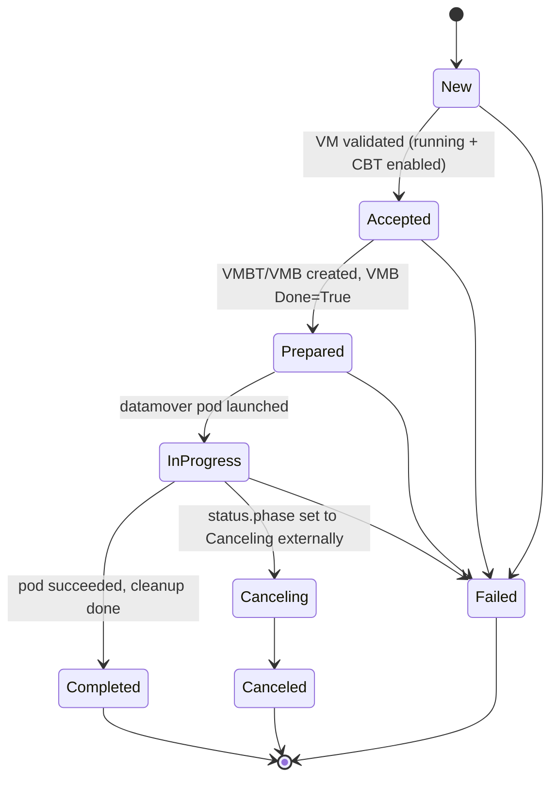
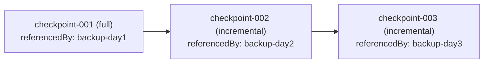
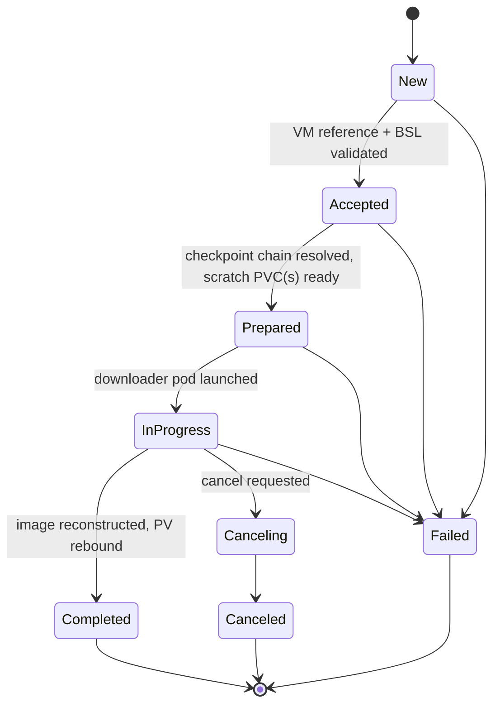

# Architecture

This document explains how `kubevirt-datamover-controller` (KDM) works under the hood: how it
plugs into Velero and OADP, how it drives KubeVirt's Changed Block Tracking (CBT) backup and
restore APIs, and how it lays out incremental backup data in object storage. It's aimed at
developers and contributors working on this repo. If you're looking for end-user configuration
and workflows, see the
[OADP operator's KubeVirt datamover documentation](https://github.com/openshift/oadp-operator/tree/oadp-dev/docs/kubevirt-datamover)
and the [original design proposal](https://github.com/openshift/oadp-operator/blob/oadp-dev/docs/design/kubevirt-datamover.md).

## System overview

KDM isn't a standalone product. It's one of three cooperating components that together give
OADP/Velero VM-aware, incremental backup and restore for KubeVirt VirtualMachines:

| Component | Repository | Role |
|---|---|---|
| `kubevirt-datamover-plugin` | [migtools/kubevirt-datamover-plugin](https://github.com/migtools/kubevirt-datamover-plugin) | Velero `BackupItemAction`/`RestoreItemAction`/`DeleteItemAction` plugins. Detects VMs and PVCs eligible for the KubeVirt datamover path (via Velero's `VolumePolicy`), creates the `DataUpload`/`DataDownload` CRs, and reports async operation progress back to Velero. |
| `kubevirt-datamover-controller` (this repo) | migtools/kubevirt-datamover-controller | Reconciles `DataUpload`/`DataDownload` CRs where `spec.datamover == "kubevirt"`. Drives KubeVirt's `VirtualMachineBackup`/`VirtualMachineBackupTracker` CBT APIs, launches short-lived "datamover pods" that move qcow2 data to and from the `BackupStorageLocation` (BSL), and maintains the checkpoint chain index in object storage. |
| `oadp-operator` | [openshift/oadp-operator](https://github.com/openshift/oadp-operator) | Deploys this controller (as a `Deployment`, gated by `spec.configuration.velero.defaultPlugins` containing `kubevirt-datamover`) and the plugin (as an init container on the Velero pod), wires up RBAC, and exposes tuning knobs on the `DataProtectionApplication` (DPA) CR under `spec.configuration.kubevirtDatamover`. |

### Why CBT instead of CSI snapshots

Velero's default data mover snapshots a PVC via CSI and then scans (and deduplicates) the
whole volume with Kopia or restic. VM disks are different: KubeVirt and libvirt already track
which disk blocks changed since the last backup, through CBT. This controller reads that
block-level diff directly instead of scanning the full volume, which means smaller and faster
incremental backups that are aware of the VM's actual libvirt checkpoint chain, rather than
treating the PVC as an opaque blob of data.

## CRDs this controller acts on

- **Velero `DataUpload`/`DataDownload`** (`velero.io/v2alpha1`): the controller only reconciles
  instances where `spec.datamover == "kubevirt"` (`pkg/common.DataMoverKubeVirt`). Everything
  else is left alone so Velero's built-in node-agent data mover can handle it.
- **KubeVirt `VirtualMachineBackup` (VMB)** and **`VirtualMachineBackupTracker` (VMBT)**
  (`backup.kubevirt.io/v1alpha1`): KubeVirt's native CBT backup primitives. The VMBT is the
  long-lived object that carries `status.latestCheckpoint` (the libvirt checkpoint name); the
  VMB is a single backup request that references a VMBT as its `spec.source`.
- **KubeVirt `VirtualMachine`** (`kubevirt.io/v1`): read to validate prerequisites
  (`pkg/common.ValidateVMForBackup`) and to list the VM's PVCs and DataVolumes
  (`pkg/common.GetVolumesForVm`).
- **`PersistentVolumeClaim`/`PersistentVolume`**: the controller creates temporary PVCs,
  rebinds PVs across namespaces (VM namespace to OADP namespace and back), and provisions
  restore target PVCs.
- **`Pod`**: short-lived datamover pods (`kubevirt-dm-*` for uploads, `kubevirt-dm-dl-*` for
  downloads) run the same controller binary in `upload`/`download` subcommand mode
  (`/manager upload` or `/manager download`) to move qcow2 data.

## Backup (DataUpload) reconciliation phases

The `KubeVirtDataUploadReconciler` (`internal/controller/kubevirt_dataupload_controller.go`)
drives a `DataUpload` through Velero's standard `DataUpload` phase enum:



A note on cancellation: the DataUpload reconciler does not watch `spec.Cancel` itself. It
only reacts once something else, typically Velero's own DataUpload controller, has already
set `status.phase` to `Canceling`; `handleCanceling` then runs cleanup (deleting the datamover
pod, temporary PVC, and any VMB it created). This is different from the DataDownload
reconciler below, which does watch `spec.Cancel` directly on every reconcile. If you are
debugging a stuck cancellation, check whether `spec.Cancel` was set but `status.phase` never
moved to `Canceling`, since that would mean something upstream (Velero, or a user editing the
object directly) needs to make that transition for a DataUpload.

### New to Accepted (`handleNew`)

1. Extract the source VM reference from the `kubevirt-datamover.io/vm-name` and
   `kubevirt-datamover.io/vm-namespace` annotations on the `DataUpload` (set by the plugin;
   namespace defaults to `spec.sourceNamespace` if unset).
2. Fetch the `VirtualMachine` and validate prerequisites (`common.ValidateVMForBackup`):
   - The VM must be `Running` (`status.printableStatus == Running`). Offline backup isn't
     supported.
   - CBT must be enabled: `status.changedBlockTracking.state == Enabled`.
3. Record `status.acceptedTimestamp` (used later to enforce `spec.operationTimeout`) and move
   to `Accepted`, or fail if validation didn't pass.

### Accepted to Prepared (`handleAccepted`)

This is where most of the work happens:

1. **Per-VM serialization.** Only the oldest active `DataUpload` for a given VM proceeds
   (`hasOlderActiveDUForVM`); younger ones wait their turn. This guarantees the previous
   backup's checkpoint is fully committed to the BSL before the next backup starts, which is
   what makes incremental backups safe. A configurable `--stale-dataupload-threshold` (default
   2 hours) stops an abandoned or stuck `DataUpload` from blocking newer ones forever.
2. **BSL health check.** The `BackupStorageLocation` must be `Available`. If it isn't, the
   controller fails fast instead of creating PVCs, a VMBT, and a VMB that would just get
   wasted.
3. **Temporary backup PVC.** A scratch PVC (`kubevirt-backup-*`) is created, or reused if it
   already exists, in the VM's namespace to receive the qcow2 output from KubeVirt's backup
   process. Its size is calculated by `calculateBackupPVCSize`, and can be overridden with the
   `kubevirt-datamover.io/backup-pvc-size` annotation.
4. **VirtualMachineBackupTracker (VMBT) preparation** (`prepareVMBackupTracker`):
   - Reuse an on-cluster VMBT for the VM if one already exists (matched via the
     `kubevirt-datamover.io/vm-name-hash` label). KubeVirt needs this VMBT to persist across
     backups so its checkpoint state survives VM lifecycle events.
   - Otherwise, look up the archived `vmbt.json` from the BSL's per-VM checkpoint index (see
     [Object storage layout](#object-storage-layout-and-the-checkpoint-chain) below) and
     recreate the VMBT on-cluster with `status.latestCheckpoint` restored from that archive.
     This fallback only matters if the on-cluster VMBT is ever missing, since in normal
     operation the VMBT stays on the cluster across backups and only the VMB gets deleted
     after each one (see "What the datamover pod does during upload" below).
5. **Backup mode resolution** (`resolveBackupMode`/`validateBSLCheckpoint`): decide whether
   this backup must be a **full** backup or can be **incremental**, in this priority order:
   - The `kubevirt-datamover.io/force-full-backup: "true"` annotation.
   - Independently walking the BSL's checkpoint chain (`LookupLatestCheckpoint` in
     `pkg/uploader/bsl_lookup.go`) to confirm a valid, unbroken chain exists. If the chain is
     broken, or no checkpoint exists yet, the controller forces a full backup.
   - `--max-incremental-backups` (global, or a per-VM override via the
     `kubevirt-datamover.io/max-incremental-backups` VM annotation): once the incremental count
     since the last full backup reaches this limit, the next backup is forced full.
   - The VMBT's own `status.latestCheckpoint` is cross-checked against the BSL's independently
     computed latest checkpoint. A mismatch (a stale archived VMBT) also forces a full backup.
6. **VirtualMachineBackup (VMB) creation** (`ensureVMBackup`): create a VMB in the VM's
   namespace with `spec.source` referencing the VMBT, `spec.pvcName` set to the temp backup
   PVC, and `spec.forceFullBackup` set based on the decision above. KubeVirt's admission
   webhook only allows one active VMB per VM at a time; if another is already in progress the
   controller requeues instead of failing.
7. **Wait for VMB completion** (`evaluateVMBackupStatus`): poll the VMB's `status.conditions`
   (`Progressing`, `Done`, `Initializing`). `Done=True` without a failure reason means the
   backup succeeded and the qcow2 file(s) are now in the temp PVC. The controller reads
   `status.type` (`full`/`incremental`) and `status.checkpointName` from the completed VMB and
   moves to `Prepared`. Any failure condition moves to `Failed` with the extracted reason. A
   VMB stuck in `Initializing` with a since-deleted VMBT is detected and failed immediately
   rather than polled forever.

### Prepared to InProgress (`handlePrepared`)

1. Enforce `--max-concurrent-data-movers` if it's set. Each reconciler applies this limit to
   its own resource type independently, so a value of `5` allows up to 5 DataUploads active
   at once and, separately, up to 5 DataDownloads active at once, not 5 total across both.
   This gates pod creation before any further work happens.
2. **Rebind the PV** holding the temp backup PVC from the VM's namespace into the OADP
   namespace (`rebindPVToNamespace` in `pv_rebind.go`). This is needed because the datamover
   pod has to access both the backed-up data and the BSL credentials/config at the same time,
   and those live in the OADP namespace.
3. Build the datamover pod spec (`buildDatamoverPodConfig`/`buildDatamoverPod`) with the VMB's
   checkpoint name and type, the VMBT name, BSL connection settings, and credentials, then
   create the pod (`kubevirt-dm-<dataupload-name>-*`) with an owner reference to the
   `DataUpload` for automatic cleanup. Move to `InProgress`.

### InProgress to Completed/Failed (`handleInProgress`)

The controller polls the datamover pod's phase. `PodSucceeded` marks
`kubevirt-datamover.io/datamover-pod-succeeded`, cleans up the temp PVC/PV and rebound
resources, and moves to `Completed`. `PodFailed` extracts the failure message from the pod and
moves to `Failed`. Resources are deliberately left alone on failure so they can be inspected
for debugging. `Pending`/`Running` just keeps requeuing.

### What the datamover pod does during upload

The pod runs `/manager upload` (`pkg/uploader/run.go`), which:

1. Initializes an object store client from BSL env vars
   (`pkg/uploader/objectstore.go`, `s3_objectstore.go`, `azure_objectstore.go`,
   `gcp_objectstore.go`).
2. Reads the qcow2 file(s) from the mounted (rebound) temp PVC.
3. Uploads them to `checkpoints/<vm-namespace>/<vm-name>/<checkpoint-id>/*.qcow2` in the BSL
   bucket.
4. Archives the VMB and VMBT as JSON (`vmb.json`/`vmbt.json`) alongside the checkpoint, then
   **deletes the VMB from the cluster** (`cleanupKubeResources` in `pkg/uploader/run.go`). The
   VMBT is deliberately left on the cluster, not deleted, so KubeVirt can reuse it to redefine
   the VM's libvirt checkpoint across restarts and live migrations (see step 4 in "Prepared to
   InProgress" above and `prepareVMBackupTracker`). The archived `vmbt.json` only comes into
   play as a fallback if the on-cluster VMBT is ever missing, for example if the VM's namespace
   was recreated.
5. Updates the per-VM `index.json` checkpoint index and the per-Velero-backup manifest
   (details below), correcting the index if there's a backup-type mismatch (for example, the
   VM unexpectedly lost its libvirt checkpoint and KubeVirt performed a full backup when an
   incremental one was expected).

## Object storage layout and the checkpoint chain

The uploader (`pkg/uploader/types.go`) organizes data in the BSL bucket, under a
`<bsl-prefix>-kubevirt-datamover/` object prefix, like this:

```
<bsl-prefix>-kubevirt-datamover/
├── checkpoints/
│   └── <namespace>/
│       └── <vm-name>/
│           ├── <checkpoint-id>/
│           │   ├── <vmb-name>-<disk-name>.qcow2   # Backup data files
│           │   ├── vmb.json                        # Archived VMB CR
│           │   └── vmbt.json                       # Archived VMBT CR
│           └── index.json                          # Per-VM checkpoint index
└── manifests/
    └── <velero-backup-name>/
        ├── index.json                              # Per-backup manifest
        └── <namespace>-<vm-name>.json              # Per-VM backup manifest
```

- **Per-VM index** (`checkpoints/<ns>/<vm>/index.json`): an ordered list of `CheckpointEntry`
  values, newest last. Each entry has an `id`, a `type` (`full`/`incremental`), a `parent` (the
  previous checkpoint's `id`, for incrementals), and a `referencedBy` list of Velero backup
  names that still depend on it. Checkpoints form a linked chain through `parent`:



  This is the chain `LookupLatestCheckpoint` (`pkg/uploader/bsl_lookup.go`) walks to find the
  latest **valid** checkpoint, verifying every file in the chain still exists, before allowing
  an incremental backup.
- **Per-backup manifest** (`manifests/<backup>/index.json`): lists every VM included in a
  given Velero backup and points to each VM's detailed manifest.
- **Per-VM backup manifest** (`manifests/<backup>/<ns>-<vm>.json`): the full, self-contained
  `checkpointChain` (ordered full backup first, then incrementals) needed to restore that VM
  from that specific Velero backup. This is what the restore path reads to know exactly which
  checkpoints to download and in what order, independent of the current state of the per-VM
  index.
- **Deletion**: when a Velero backup is deleted, the plugin's `DeleteItemAction`
  (`vm/delete.go` in kubevirt-datamover-plugin) removes that backup from each referenced
  checkpoint's `referencedBy`, and only deletes the checkpoint's qcow2 files and archived
  `vmb.json`/`vmbt.json` from object storage once no backup references it anymore. This is
  purely an object storage cleanup, it has no effect on the live, on-cluster VMBT. So deleting
  an old full backup that a newer incremental still depends on won't break the chain.

## Restore (DataDownload) reconciliation phases

The `KubeVirtDataDownloadReconciler`
(`internal/controller/kubevirt_datadownload_controller.go`) follows the same phase names, but
unlike the DataUpload reconciler above, it watches `spec.Cancel` directly on every reconcile
and drives its own transition into `Canceling` (with special handling if a cancel races an
already-provisioned restore):



1. **New to Accepted**: validate the VM reference and BSL accessibility.
2. **Accepted to Prepared**: read the per-Velero-backup, per-VM manifest
   (`manifests/<backup>/<ns>-<vm>.json`) to get the `checkpointChain`, then validate that chain
   against the per-VM index (`ResolveCheckpointFiles` in `pkg/downloader/chain.go`, which
   confirms the chain's ordering, parent links, and object paths are internally consistent).
   Provision scratch PVC(s) for the downloaded qcow2 chain. For a Block-mode restore target,
   two scratch volumes are used: a Filesystem "work" PVC holding the qcow2 chain and a Block
   "output" PVC receiving the final flattened image, labeled with
   `kubevirt-datamover.io/scratch-volume-role: work|output`. A Filesystem-mode target only
   needs one scratch PVC that serves both roles.
3. **Prepared to InProgress**: launch a downloader pod (`kubevirt-dm-dl-*`, running
   `/manager download`) that downloads every qcow2 in the chain, then uses `qemu-img` to
   **rebase** each file's backing-file reference onto its locally downloaded predecessor
   (`pkg/downloader/reconstruct.go`, since the backing path recorded at backup time refers to
   a path on the backup pod's filesystem that doesn't exist on the restore pod) and finally
   flattens/converts the chain into the target's raw disk image (`disk.img` for Filesystem
   mode, or directly onto the Block-mode output device).
4. **InProgress to Completed**: the restored PV is rebound onto the restore target PVC,
   reusing the same `pv_rebind.go` machinery as backup but in reverse. Once every
   `DataDownload` for a given restored VM completes, the controller restores the VM's original
   run strategy, which was stashed by the plugin's `vm/restore.go` in the
   `kubevirt-datamover.io/original-run-strategy` annotation before the restore forced it to
   `Halted`. That way a VM with multiple disks doesn't start running before all of them are
   restored.

## Concurrency, ordering, and safety mechanisms

- **Per-VM backup serialization** (`hasOlderActiveDUForVM`/`outranksDataUpload`) ensures
  backups for the same VM finish in order, which the checkpoint chain design depends on.
- **`--max-concurrent-data-movers`** bounds how many DataUploads/DataDownloads may hold active
  resources (PVC plus pod) at once, independent of `--max-concurrent-reconciles`, which only
  bounds controller-runtime worker goroutines.
- **`spec.operationTimeout`** is enforced across the non-terminal phases (Accepted, Prepared,
  InProgress) so a stuck backup or restore eventually fails instead of blocking younger
  DataUploads/DataDownloads for the same VM forever. Enforcement is skipped once a datamover
  pod has already reported success, so a slow cleanup step is never mistaken for failure.
- **Idempotent phase handlers**: every phase handler re-checks for already-created resources
  (existing VMB, pod, rebound PVC) before creating new ones, so a reconcile retried after a
  partial failure or cache staleness doesn't duplicate work.
- **Backup-type mismatch detection**: the controller records the expected backup type
  (`kubevirt-datamover.io/expected-backup-type`) based on its own BSL chain validation, and
  compares it against what KubeVirt's VMB actually reports, catching the case where a VM
  silently lost its libvirt checkpoint and KubeVirt fell back to a full backup.

## Credentials and object storage providers

The controller and its datamover pods support the same BSL provider surface as Velero's
built-in plugins, configured through `pkg/common.ObjectStoreConfig` and implemented in
`pkg/uploader/{s3,azure,gcp}_objectstore.go`:

- **AWS S3 / S3-compatible**: standard secret-based credentials, plus STS through a projected
  service-account token (`bound-sa-token` volume, audience `openshift`), custom endpoints,
  path-style addressing, server-side encryption (AES256/KMS/DSSE), SSE-C through a mounted
  secret, and checksum algorithm selection.
- **Azure Blob**: storage-account key or Azure AD (workload identity) auth. When Azure
  Workload Identity env vars (`AZURE_TENANT_ID`, `AZURE_CLIENT_ID`,
  `AZURE_FEDERATED_TOKEN_FILE`) are present on the controller pod, they're propagated to
  datamover pods automatically.
- **GCP Cloud Storage**: service-account-based signing and Cloud KMS server-side encryption.

Credentials are mounted read-only into datamover pods from the BSL's credentials `Secret`
(`buildCredentialsVolume`) at a fixed path, and the pods run under the `velero` service
account so they inherit the same SCC/RBAC that Velero itself needs for privileged volume
access.

## Key packages

| Package | Responsibility |
|---|---|
| `internal/controller` | `DataUpload`/`DataDownload` reconcilers, datamover pod spec construction (`pod_builder.go`), and cross-namespace PV rebinding (`pv_rebind.go`). |
| `pkg/common` | Shared constants (annotation/label keys, naming prefixes), VM reference and validation helpers, and the `ObjectStoreConfig` shared by the uploader and downloader. |
| `pkg/uploader` | Datamover pod logic for the backup path: object store clients, checkpoint index/manifest read-write, BSL checkpoint chain lookup (`bsl_lookup.go`), and the `upload` subcommand entrypoint (`run.go`). |
| `pkg/downloader` | Datamover pod logic for the restore path: checkpoint chain resolution (`chain.go`), qcow2 download, `qemu-img` rebase/flatten (`reconstruct.go`), and the `download` subcommand entrypoint (`run.go`). |

## See also

- [`docs/testing.md`](testing.md): setting up an end-to-end test environment and running a
  manual backup and restore.
- [OADP KubeVirt Datamover design document](https://github.com/openshift/oadp-operator/blob/oadp-dev/docs/design/kubevirt-datamover.md):
  the original design proposal this implementation is based on.
- [OADP operator KubeVirt datamover user docs](https://github.com/openshift/oadp-operator/tree/oadp-dev/docs/kubevirt-datamover):
  configuration, backup/restore workflows, and troubleshooting for end users.
